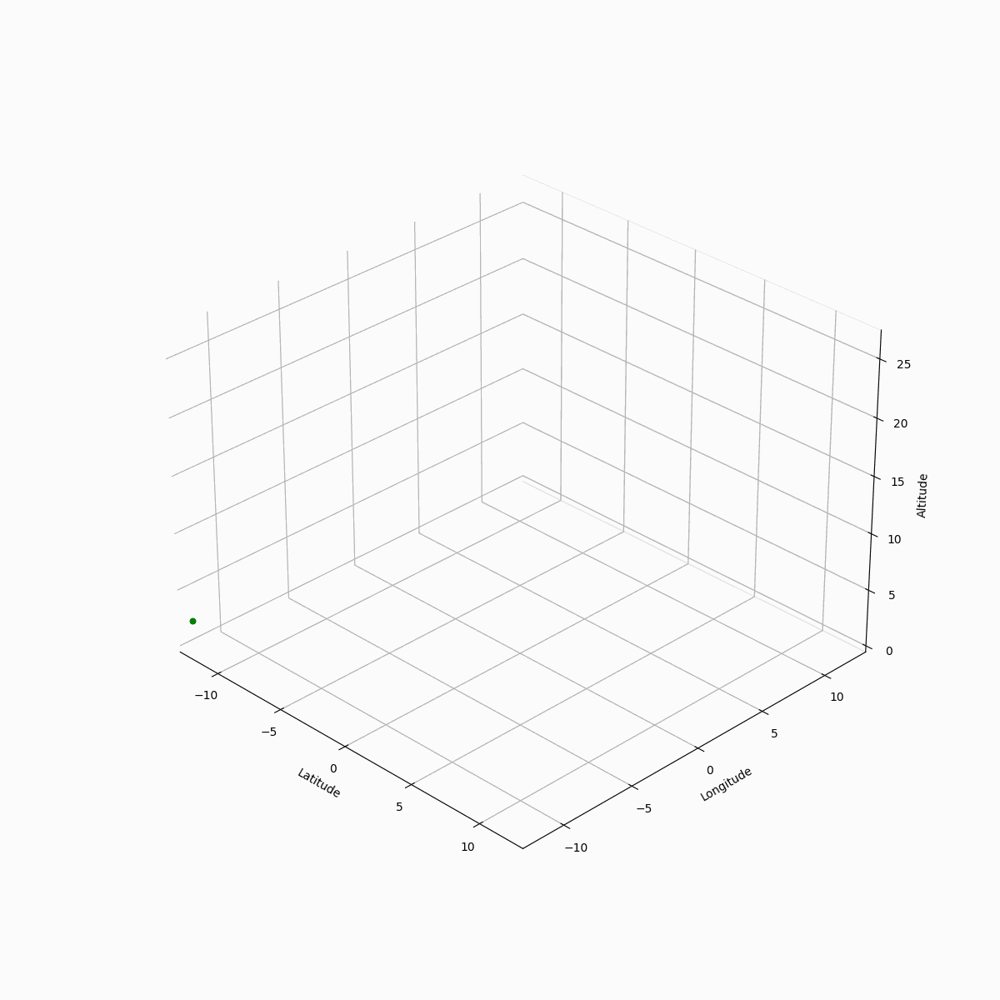

# Drone tracking and identification system
This thesis aimed to develop a system that will solve the issue of drones’ accurate identification and tracking, according to data from radars and sensors. The object of research is the process of drones tracking and identifying from the radars and sensors. As a result of the thesis, a conceptual model was presented, and the MVP of the corresponding software was created to solve the problem of drones’ automated identification and tracking according to the data coming from the radar and camera.

